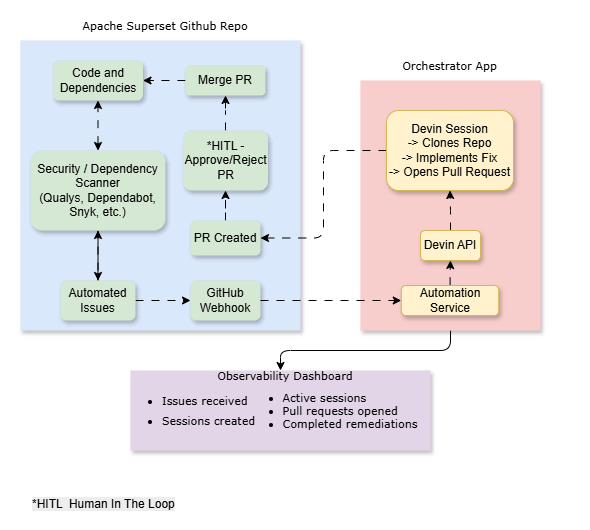

# Autonomous Issue Remediation using Devin

## Executive Summary

Engineering teams accumulate technical debt in the form of dependency upgrades, vulnerability fixes, and code quality issues. While these tasks are important, they often compete with feature delivery and remain unresolved for long periods.

This project demonstrates an event-driven automation that uses Devin as an autonomous software engineer. When an issue is created in a GitHub repository, the system automatically launches a Devin session, tracks remediation progress, and provides engineering leadership with visibility into outcomes through an observability dashboard.

The solution was built against a fork of Apache Superset and demonstrates how engineering organizations can operationalize Devin to reduce repetitive maintenance work.

---

## Problem Statement

Engineering teams frequently encounter:

- Dependency upgrades
- Security vulnerability remediation
- Code quality improvements
- Backlog maintenance tasks

These tasks are repetitive, important, and often deprioritized in favor of feature work.

The objective of this solution is to transform these engineering tasks into autonomous workflows executed by Devin.

---

## Why Devin?

Traditional automation tools can identify problems but cannot independently:

- Understand repository context
- Modify source code
- Adapt to test failures
- Produce pull requests

Devin acts as an autonomous engineering agent capable of reasoning about the repository, implementing fixes, validating changes, and contributing back via pull requests.

This solution positions Devin as the primary execution engine rather than a simple helper tool.

---

## Architecture



---

## End-to-End Workflow

1. A security scanner (e.g. Snyk, Dependabot) or code quality tool detects an issue and creates a GitHub issue labeled `devin-fix`
2. GitHub sends a webhook event to the FastAPI server
3. FastAPI receives the event and validates the signature
4. A Devin session is created automatically with a structured prompt
5. Devin analyzes the repository
6. Devin implements the remediation
7. Devin creates a pull request
8. The dashboard tracks task progress, completion, and business metrics

> **Note:** In this demo, issues are seeded manually via `scanner/create_issues.py` to simulate what a scanner would produce. The webhook and Devin dispatch are fully automated from that point forward.

---

## Repository Structure

```
app/
├── main.py              # FastAPI webhook server + dashboard
├── devin_client.py      # Devin API wrapper
└── models.py            # Pydantic models

scanner/
├── create_issues.py     # Seed issues into the target repo
├── reset_issues.py      # Close test issues, recreate real ones
└── close_duplicates.py  # Cleanup utility

observability/
└── sessions.db          # SQLite — session tracking

Dockerfile
docker-compose.yml
.env.example
README.md
```

---

## Setup

### 1. Configure environment

```bash
cp .env.example .env
```

Fill in:

```
DEVIN_API_KEY=your_devin_api_key
DEVIN_ORG_ID=your_devin_org_id
GITHUB_TOKEN=your_github_pat
GITHUB_REPO=your-username/apache-superset-fork-cp
GITHUB_WEBHOOK_SECRET=your_webhook_secret
```

### 2. Start the server

```bash
docker-compose up --build
```

### 3. Seed demo issues (one-time, simulates scanner output)

```bash
pip install -r requirements.txt
python scanner/create_issues.py
```

In production, a security scanner or Dependabot would create these issues automatically.

### 4. Configure GitHub webhook

In your fork → Settings → Webhooks → Add webhook:
- Payload URL: `http://<your-server-ip>/webhook`
- Content type: `application/json`
- Secret: your `GITHUB_WEBHOOK_SECRET`
- Events: Issues only

### 5. View dashboard

```
http://<your-server-ip>/dashboard
```

---

## How to Simulate the Workflow

This section walks through triggering the full end-to-end pipeline from scratch.

### Prerequisites

- Docker and Docker Compose installed on the server
- `.env` file configured (see Setup step 1)
- GitHub webhook pointing to your server (see Setup step 4)

### Step 1 — Start the server

```bash
docker-compose up --build -d
```

Verify it is running:

```bash
curl http://localhost/dashboard
```

### Step 2 — Seed issues into the target repo

This simulates what a security scanner or Dependabot would produce:

```bash
python scanner/create_issues.py
```

This creates 3 issues in the fork labeled `devin-fix`:
- Pillow CVE dependency upgrade
- Replace deprecated `datetime.utcnow()` calls
- Add type hints to `superset/utils/core.py`

### Step 3 — Observe webhook dispatch

Each issue creation fires a GitHub webhook. The server receives it, validates the signature, and dispatches a Devin session. Check server logs:

```bash
docker-compose logs -f
```

You should see a log line per issue confirming the Devin session ID.

### Step 4 — Watch Devin work

Open the Devin session URLs from the dashboard to watch Devin clone the repo, implement the fix, and open a pull request in real time.

### Step 5 — View results

- Dashboard: `http://<your-server-ip>/dashboard` — shows session status, PR links, and metrics
- Pull requests: `https://github.com/<your-username>/apache-superset-fork-cp/pulls`

### Trigger a single issue manually (optional)

To test a single webhook trigger without running the full scanner:

```bash
curl -X POST http://localhost/webhook \
  -H "Content-Type: application/json" \
  -H "X-Hub-Signature-256: sha256=<computed-hmac>" \
  -d '{
    "action": "labeled",
    "issue": {
      "number": 99,
      "title": "Test: add missing __all__ export",
      "html_url": "https://github.com/<your-username>/apache-superset-fork-cp/issues/99",
      "labels": [{"name": "devin-fix"}]
    }
  }'
```

---

## Observability

The dashboard answers the key question an engineering leader asks:

> "Is this actually working, and is it saving us time?"

Metrics provided:

| Metric | Description |
|--------|-------------|
| Tasks Submitted | Total issues dispatched to Devin |
| Tasks Completed | Sessions that finished with a PR |
| Tasks Failed | Sessions that errored |
| Success Rate | Completed / Submitted |
| PRs Created | Pull requests opened by Devin |
| Eng. Hours Saved | PRs × 2hrs estimated fix time |
| ACUs Consumed | Devin compute cost |

---

## Business Impact

This solution enables:

- Faster remediation of engineering backlog
- Continuous repository health improvement
- Reduced manual engineering effort
- Better visibility into autonomous work
- Increased adoption of Devin within engineering workflows

---

## Future Enhancements

- JIRA integration as an alternative trigger
- Dependabot / security scanner integration (fully automated issue creation)
- Slack notifications on PR creation
- PR review automation
- Multi-repository support
- Custom domain + HTTPS for dashboard
- Engineering productivity analytics and trend reporting

---

## Assignment Requirement Mapping

| Requirement | Implementation |
|-------------|----------------|
| Event Trigger | GitHub Issue Webhook |
| Devin Integration | Devin Session API v3 |
| Autonomous Execution | Issue → Devin → Pull Request |
| Observability | Live dashboard + session metrics |
| Containerization | Docker Compose |
| End-to-End Demo | Apache Superset fork |

